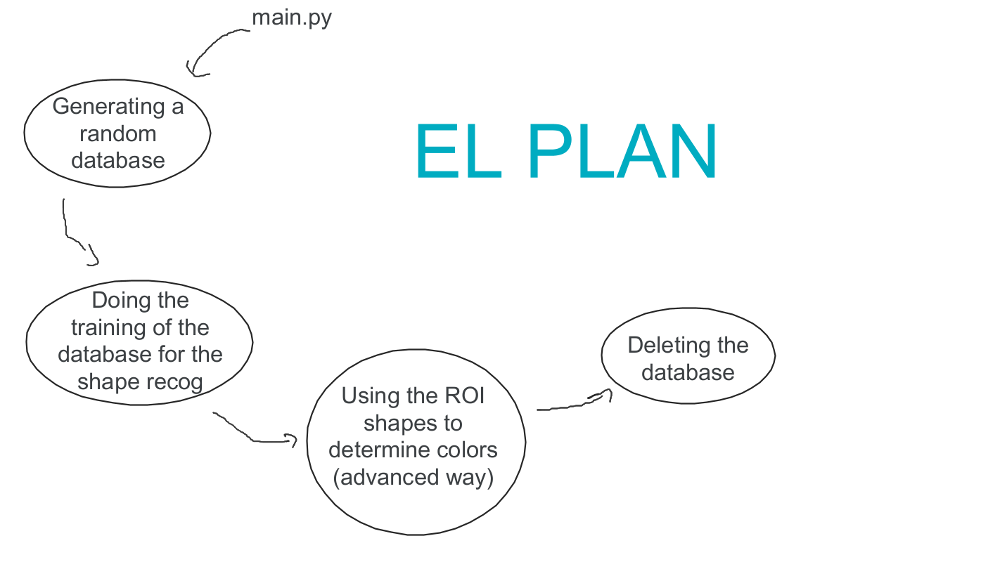
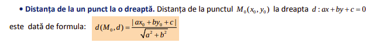
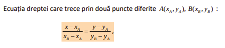

# AI Development - Avansati 

## Project structure


## Generating the database

The database is generated randomly. The ```generate-database.py``` file will generate all the images.

All the data will be stored in the ```images``` directory, where they will be sorted by what they contain. 

For each geometric figure, we implemented some restrictions :

### _Ellipses_
- The difference between the random ```width``` and the random ```X``` starting point, should be greater than 10.
- The difference between the random ```height``` and the random ```Y``` starting point, should be greater than 10.

We are having this restrictions because we do not want to generate ellipses that look like some lines.

### _Rectangles_
- The difference between the random ```width``` and the random ```X``` starting point, should be greater than 10.
- The difference between the random ```height``` and the random ```Y``` starting point, should be greater than 10.

We are having this restrictions because we do not want to generate rectangles that look like some lines.

How did we do that ? Well, the answer is 10th grade math ! :D

We used 2 formulas : 



With these formulas, the script will always generate figures that look like triangles. 

### _Triangles_
- All the points should not be collinear.
- The distance between the 3rd point and the line which contains the first 2 points, should be greater than 5.

Again, we're doing this cause we do not want to generate some figures that look like some lines.


## Cleaning up the data
When we want to delete all the images from the database, we can easily run the ```database-cleanup.py``` file. This script will erase all the images, but not the directories.

By CodeGroupTM
