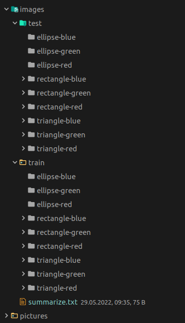
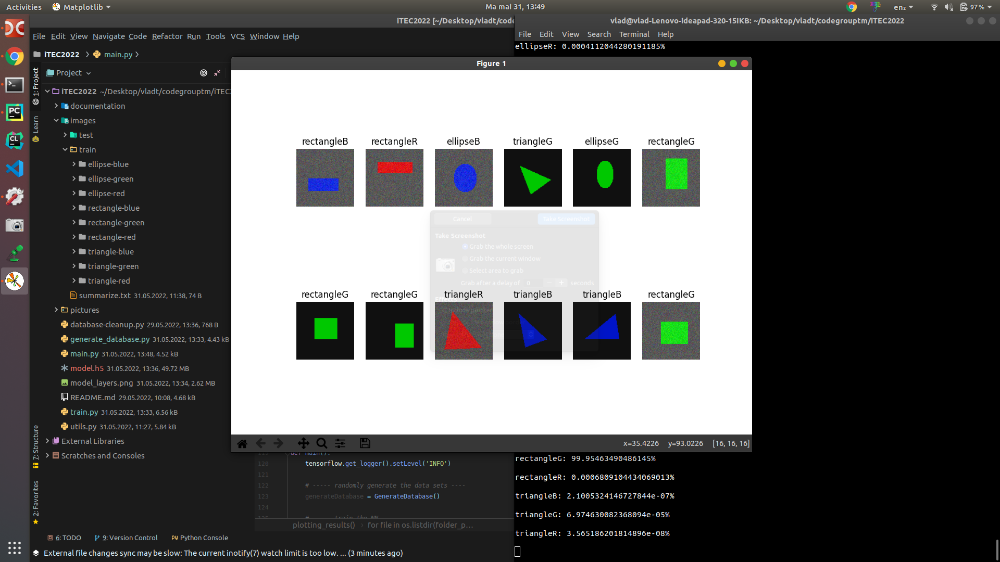

# AI Development - Avansati 

## Project structure
1) Generating a random data set 
2) Uploading to the trainer
3) Traning it
4) Extracting a model 
5) Using it for some pictures (that can be argparsed through the ```main.py``` file).

## Generating the database

The database is generated randomly. The ```generate-database.py``` file will generate all the images.

All the data will be stored in the ```images``` directory, where they will be sorted by what they contain. 

For each geometric figure, we implemented some restrictions :

### _Ellipses_
- The difference between the random ```width``` and the random ```X``` starting point, should be greater than 10.
- The difference between the random ```height``` and the random ```Y``` starting point, should be greater than 10.
- The area of the triangles should have a good value.

We are having this restrictions because we do not want to generate ellipses that look like some lines.

### _Rectangles_
- The difference between the random ```width``` and the random ```X``` starting point, should be greater than 10.
- The difference between the random ```height``` and the random ```Y``` starting point, should be greater than 10.
- The area of the triangles should have a good value.

We are having this restrictions because we do not want to generate rectangles that look like some lines.

How did we do that ? Well, the answer is 10th grade math ! :D

We used 2 formulas : 


With these formulas, the script will always generate figures that look like triangles. 

### _Triangles_
- All the points should not be collinear.
- The distance between the 3rd point and the line which contains the first 2 points, should be greater than 5.
- The area of the triangles should have a good value.

Again, we're doing this cause we do not want to generate some figures that look like some lines.

During Friday and the first half of Satudrday, I was able to generate all the geometric figures. Unfortunately, I discovered a problem in generating the ellipses.

Something very weird which i did not have the enough time to debug it.... 

Probably a stupid mistake generated by the long night.

## Classes 
I decided that the most efficient way would be to solve the shape and the color challenged using one neural net. So these are the classes that I have decided using.
- rectangleR
- rectangleG
- rectangleB
- triangleR
- triangleG
- triangleB
- ellipseR
- ellipseG
- ellipseB

For each class, I decided to generate the data sets into separate folders, with the name of the class, into the ```images``` directory. 



## Images for demo
The ```pictures``` directory contains all the pictures that can be used for the demo. 

## Cleaning up the data
When we want to delete all the images from the database, we can easily run the ```database-cleanup.py``` file. This script will erase all the images, but not the directories.

## Specs
The model was based on the DenseNet architecture. The layers can be visualized by opening the ```model_layers.png```

I was able to obtain an accuracy of aprox 98%. But it take some time to be trained. I decided to set the epoches to 5 and the steps_per_epoch to 50.

```
Epoch 1/5
50/50 - 258s - loss: 0.5222 - accuracy: 0.9662 - precision: 0.8708 - recall: 0.8175 - auc: 0.9789 - val_loss: 0.2458 - val_accuracy: 0.9888 - val_precision: 0.9929 - val_recall: 0.9058 - val_auc: 0.9997
Epoch 2/5
50/50 - 331s - loss: 0.1195 - accuracy: 0.9921 - precision: 0.9685 - recall: 0.9600 - auc: 0.9990 - val_loss: 0.0586 - val_accuracy: 0.9988 - val_precision: 0.9993 - val_recall: 0.9903 - val_auc: 1.0000
Epoch 3/5
50/50 - 348s - loss: 0.1227 - accuracy: 0.9911 - precision: 0.9612 - recall: 0.9588 - auc: 0.9978 - val_loss: 0.0357 - val_accuracy: 0.9978 - val_precision: 0.9911 - val_recall: 0.9891 - val_auc: 0.9999
Epoch 4/5
50/50 - 354s - loss: 0.1369 - accuracy: 0.9904 - precision: 0.9597 - recall: 0.9538 - auc: 0.9971 - val_loss: 0.0123 - val_accuracy: 0.9998 - val_precision: 0.9993 - val_recall: 0.9989 - val_auc: 1.0000
Epoch 5/5
50/50 - 446s - loss: 0.0812 - accuracy: 0.9944 - precision: 0.9774 - recall: 0.9725 - auc: 0.9990 - val_loss: 0.0065 - val_accuracy: 0.9997 - val_precision: 0.9986 - val_recall: 0.9984 - val_auc: 1.0000
```

And the results look something like this : 



## Credits

There are probably more details that I would love to talk about with you. So I am open to any form of communication :)

A project made by Vlad Tomici (+40 722 594 770), 10th grade student from "Grigore Moisil" Theoretical Highschool, Timisoara.

CodeGroupTM team 